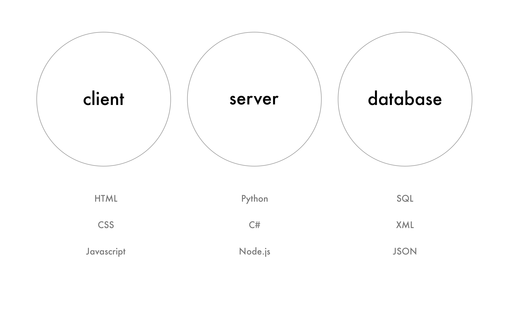
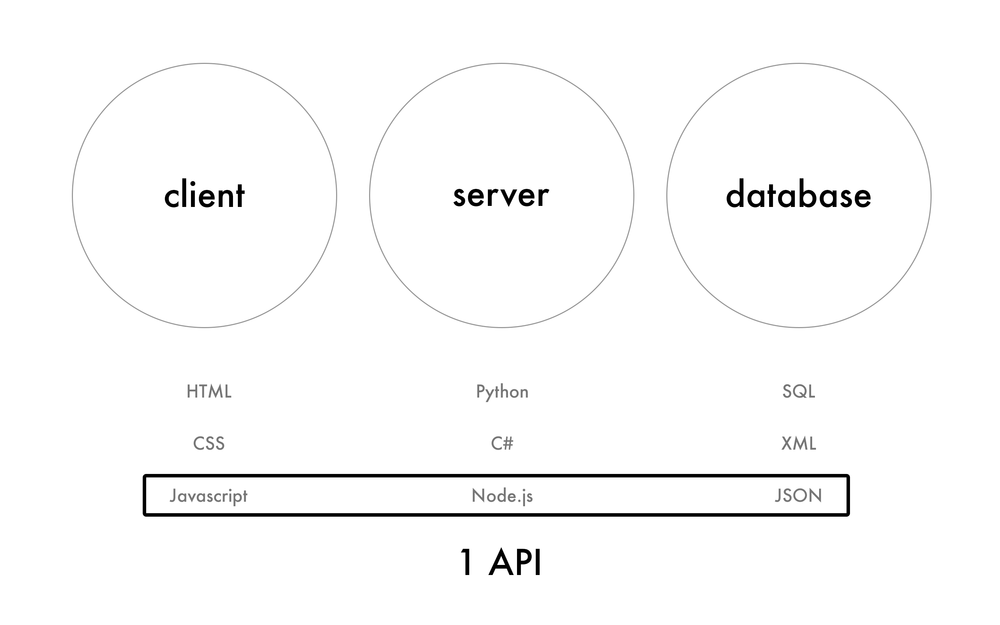

footer: [Q42.com](http://q42.com)
slidenumbers: true

---

# Hello from the future

^Hello. I'm here from the future to tell you about Meteor.

^Meteor is a new way of thinking about building software. It dramatically
simplifies many of the things we take for granted today. In order to do that,
it challenges our assumptions and even throws out some ideas we may otherwise
believe are "just the way it works".

^In order to explain it, I'm going to back up and take a moment to describe
the rough status quo -- how they've worked for a long time.

---

# I'm [@Rahul](http://twitter.com/rahul)!
## Running [@Q42](http://twitter.com/q42) USA

### [q42.com/meteor](http://q42.com/meteor)

^But wait, who am I?

^Well, I work at a Dutch tech consulting company called Q42. There are sixty of us,
and I'm starting the US branch here in Mountain View.

^We build all sorts of software, large and small.
You may have heard of some of our larger projects, such as the Philips Hue lights
that you control with your smartphone. (We also built the Nest + Hue integration
that launched recently)

^We got into Meteor in 2012 when I ported our website, and since then, we've
been doing all kinds of stuff with Meteor. Check out our website for more.

^I've also been organising talks and demos like these. Because I think everyone
should know how great it is :)

---

# Have you used Meteor yet?

^Before we get started, let's see hands.
Who among you have already built something with Meteor?

---

# Who makes Meteor?
## [meteor.com](http://meteor.com)

^Meteor is an open source project backed by a startup based in San Francisco.
This is different than most open source projects, which are usually done in
someone's spare time, or part of a large tech company.

---

# Why make Meteor?

^The team at Meteor Development Group realised that companies like Google, Facebook
and Asana have the resources to build expansive reactive frameworks to power
their products, but that regular folks don't have access to them, so they set out
to do just that.

---

# Status quo

^To get a sense of what Meteor is trying to achieve, let's take a look at
the status quo.

^We'll move on to the demo shortly, but you should understand the design goals
first.

---

^Most apps today have this separation of client, server and database.
Three different technology layers, often using different languages, frameworks
and programming approaches.

---

^What Meteor does is say: what if instead of these being separate, they were
all one API? What do we gain from that?

^What I like about Meteor is that it challenges your assumptions about how
you should build software. Let's take a look at how.

---

# Principles & buzzwords (1)

- Less code with reactive programming
- One language everywhere with isomorphic APIs
- Hot deploys

---

# Principles & buzzwords (2)

- Ultra responsiveness with latency compensation
- Unified "isopackage" ecosystem
- Live updates

^So Meteor comes with a bunch of buzzwords :) but they all relate back to
these original principles that the team at Meteor believes in.

^First, this belief that using a reactive programming model leads to radically
less code. We'll see how that works in the demo.
Second, the idea as I described earlier that one language gives you advantages
you didn't have access to before.
Third, hot deploys - the idea that you can deploy code without disrupting the user's
session.
Fourth, latency compensation, which makes the app feel more responsive by not
having to wait on the server for the UI to update.
Fifth, Meteor is designed as a modular ecosystem of packages. Packages in Meteor
are completely different than in something like Node, because they can include
client and server code and even their own database.

^And the current hip thing, live updates. But live updates with Meteor are
dramatically simpler to implement than any other platform, which leads me to...

---

# The One True Principle
## Ease of Use

^In my opinion, the biggest value Meteor brings is a revolutionary simplification
of programming. It achieves this by rethinking a lot of stuff we thought had
already been solved. It takes a little while to grok completely, but once it
clicks, you feel like you've been transported to the future and can't go back. :)

^Ease of use means Meteor is easier to get into, but also that you create fewer
bugs just by virtue of the way the platform is built. In this way it reminds me
of functional programming.

---

# [fit] `curl https://install.meteor.com/ | sh`

^Ease of use is already demonstrated the first time you even interact with Meteor.

^Just try installing it. This command just works. One command to get started, rather
than a list of steps you have to follow manually.

---

# What gets installed?

- Node.js
- Required npm packages
- MongoDB
- The Meteor platform

---

# A look at the Meteor stack

- [Blaze](http://meteor.github.io/blaze/) reactive virtual DOM engine
- Live data & client side MongoDB
- DDP

---

# Demo

^Anyway, the main reason you're here is for the demo

---

# Leaderboard

- List some people
  - Sort by table header
  - Vote people up
- Sign in with Google
  - Limit voting to signed in
  - No voting for yourself

---

# Stuff to do next

---
# Set up discrete pub/sub instead of autopublish
---
# Use allow/deny rules for security (and remove insecure)
---
# Publish to Android/iOS
- `meteor install-sdk android`  
- `meteor add-platform android`
- `meteor run android`

---

# Write your own package
## [atmospherejs.com](http://atmospherejs.com)

---

# Write some reactive integration tests
## [velocity.meteor.com](http://velocity.meteor.com)

---

# Resources

- [meteor.com/try](http://meteor.com/try) - build a todos app
- [docs.meteor.com](http://docs.meteor.com)
- [discovermeteor.com](http://disovermeteor.com) book - build a HN clone
- [bulletproofmeteor.com](http://bulletproofmeteor.com) advanced Meteor book
- [atmosphere](http://atmospherejs.com) package directory

---

# This talk on Github

## [github.com/primigenus/meteor-demo](http://github.com/primigenus/meteor-demo)
### (`mtvjs` branch)

---

# Thanks!

## [@rahul](http://twitter.com/rahul), [q42.com](http://q42.com)

### RSVP: [meetup.com/Meteor-South-Bay](http://meetup.com/meteor-south-bay)
